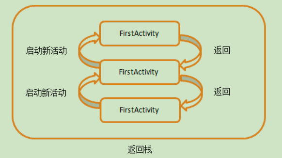
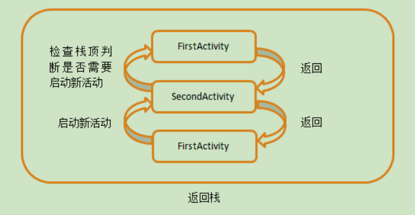
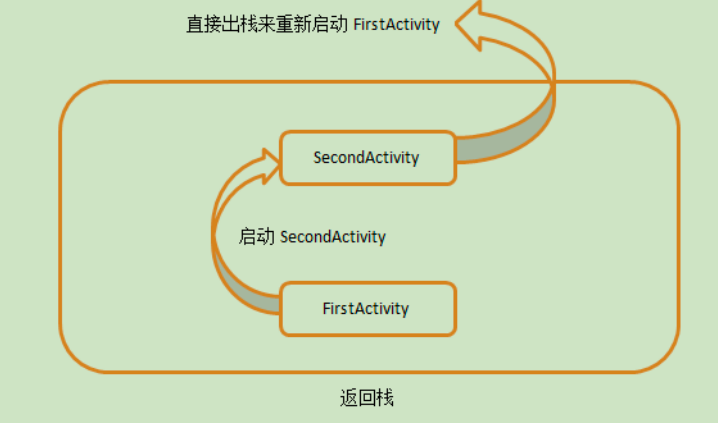
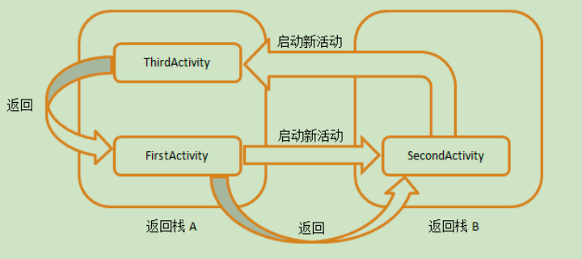

# Activity启动模式
**本篇文档用于表述解释Android页面Activity的启动模式相关问题**

## 四种启动模式

###  Standard（标准模式）
+  默认的启动模式，不会创建新的任务栈，每次启动一个Activity都会创建一个实例入栈，Activity的启动和销毁都对应着入栈和弹栈。
+  Activity的生命周期符合典型情况，既每一次打开一个Activity页面，被创建实例的onCreate，onStart，onResume方法都会被调用。
+  常用于一般使用场景。
+  场景

        启动
        A->B-C 

        销毁
        C->B->A

+ 示意图

###  singleTop（栈顶复用模式）
+   在启动一个新的Activity时，会先检查返回栈栈顶的Activity是否是即将启动的页面类型。
    +  如果是，则正常启动页面，直接复用已存在实例，此时onCreate方法不会被调用，调用onNewIntent方法完成替换。
    +  如果不是，那么将会如同标准模式一样创建一个新的Activity实例。
    + 
+  常用于详情页面，比如新闻详情页面，点击里边的推荐新闻，并没有创建新的页面，而是复用老得页面。
+  场景

       启动
       A->B->C->C

        销毁
       C->B->A
+ 示意图

###  singleTask（栈内复用模式）
+  在启动一个新的Activity时，会使用被启动Activity的任务栈，然后检查返回栈中是否已经存在了同类型的实例。
   +  如果存在，那么将该实例上边的其他Activity全部销毁，使其成为栈顶，此时onCreate方法不会被调用，会调用onNewIntent方法。
   +  如果不存在，则
+  在启动Activity时，如果返回栈中已经在了同类型的实例，那么将在已存在实例Activity上的所有页面销毁，使其成为栈顶。
+  需要注意的是，此时启动Activity是以任务栈切换的方式启动的，新启动的任务栈会放置在旧的任务栈上边。（任务栈的关联依赖taskAffinity属性，此属性默认是包名，如果属性相同/任务关联时，那么不会有任务栈切换效果，如果不相同，则切换效果为任务栈切换）

###  singleInstance（单实例模式）
+   全局单例模式，启动场景类似于singleTask（栈内复用模式），但区别是：
    + singleTask（栈内复用模式） 声明一个任务栈内只有这个类型的一个实例，可以包含其他实例。
    + singleInstance（单实例模式）声明一个任务栈仅有这个类型的一个实例，无其他实例
+   不管是哪个应用程序来访问这个活动，都共用的同一个返回栈

###

本文章参考  
[链接](https://rengwuxian.com/dang-wo-an-xia-home-jian-zai-qie-hui-lai-hui-fa-sheng-shen-me/)  
[链接](https://www.jianshu.com/p/ebde48a0a52c/)
[链接](https://www.cnblogs.com/claireyuancy/p/7387696.html)