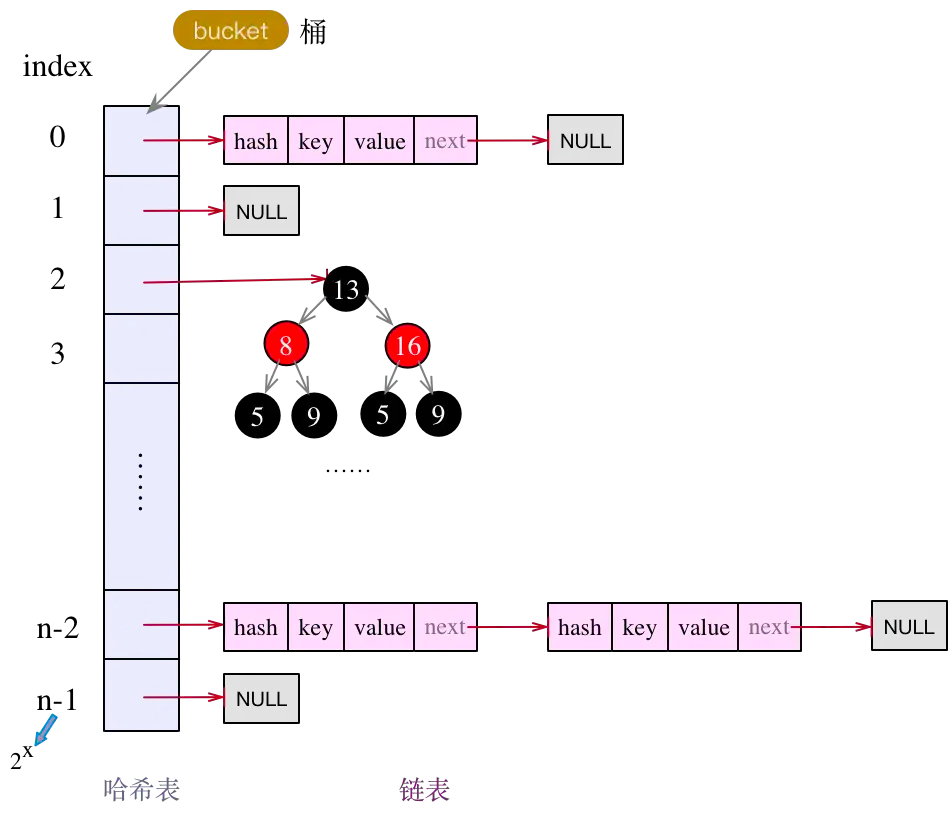

# HashMap
**本篇文档用于表述解释HashMap原理及其他相关问题**

### HashMap 原理

不管是在1.7，还是在1.8，HashMap的实现框架都是哈希表 + 链表的组合方式。不同的是，再jdk8中对链表结构做了优化，在一定的条件下(链表长度>TREEIFY_THRESHOLD)，将链表转换为红黑树，以提升查询效率。

###  put方法的处理过程

整个put方法的处理过程，可以分为4个部分
* 特殊key值处理，key为null
* 计算table中目标bucket的下标（使用key的hash计算）
* 制定目标bucket，遍历Entry节点连标，若找到key相同的Entry节点，则做替换，并返回oldValue.
* 若未找到目标的entry节点，先判断size是否>=threshold，再确定哈希table是否需要扩容（``加载因子默认为0.75``），而后新增一个节点，并返回null.
put数据时(hashMap的size为0)，判断当前hashTab的size是否>=阈值，如果满足，则容量*2， HashTab的容量只能是N次幂。

### 扩容
什么时候扩容：
* 哈希table为null或长度为0；
* Map中存储的k-v对数量超过了阈值threshold；
* 链表中的长度超过了TREEIFY_THRESHOLD，但表长度却小于MIN_TREEIFY_CAPACITY。

### fail-fast策略
什么是fail-fast :在系统设计中，当遇到可能会诱导失败的条件时立即上报错误，快速失效系统往往被设计在立即终止正常操作过程，而不是尝试去继续一个可能会存在错误的过程。再简洁点说，就是尽可能早的发现问题，立即终止当前执行过程，由更高层级的系统来做处理。
在HashMap中，和fail-fast经常一起出现的还有一个异常类ConcurrentModificationException，意为并发修改异常，如果想在多线程场景下修改/删除map的值，可以使用迭代器``Iterator``。

### jdk7 扩容死循环问题
只有jdk7及以前的版本会存在死循环现象，在jdk8中，已经对reSize()做了调整，使用两队链表，且使用了尾插法，所以不会造成死循环。
死循环的核心问题在于：jdk7的扩容方法使用了头插法，将原本的顺序做了反转，所以才会在多线程情况下有死循环隐患。

### HashMap的多线程问题
* 死循环
* 数据重复
* 数据丢失（覆盖）

### 替代品 - ConCurrentHashMap
Hash 是线程不安全的，在jdk1.5之后，可以是使用ConcurrentHashMap替代 HashMap。
``ConcurrentHashMap``使用了分段锁(jdk1.8后为 synchronized关键字 + CAS)保证了线程安全，相对于HashTable拥有更高的性能。

### 数据结构图

本文章参考[链接](https://www.jianshu.com/p/497967713014)